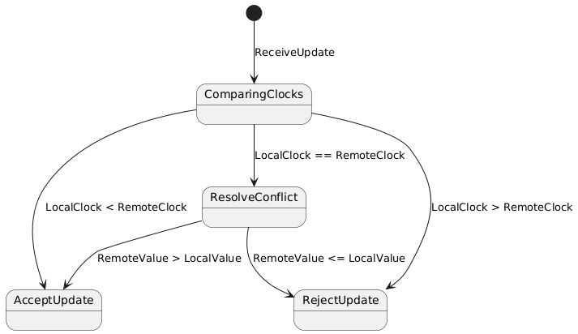

- [Alessandro Pioggia](mailto:alessandro.pioggia2@studio.unibo.it)

## Abstract

The project goal is to develop a lightweight, distributed NoSQL emulator that implements sharding and replication using a peer-to-peer (P2P) architecture. The system will follow the BASE (Basically Available, Soft state, Eventually consistent) approach, ensuring high availability and reasonable fault tolerance while prioritizing low latency for read and write operations. It’s a cli application, interaction will be based on scripts or command line commands.

## Concept

Lightweight, distributed NoSQL emulator that implements sharding and replication using a peer-to-peer (P2P) architecture. The system will follow the BASE (Basically Available, Soft state, Eventually consistent) approach, ensuring high availability and reasonable fault tolerance while prioritizing low latency for read and write operations. It’s a cli application, interaction will be based on scripts or command line commands.

### Use case collection

#### Users

Users access the system remotely via internet, using an API key.

#### Frequency ant timing of the interaction

Interaction is very frequent and latency-sensitive, as a distributed key-value storage, the system is designed for high-throughput and low-latency access, potentially handling thousands of requests per second.

#### Interaction specs and devices used

Users interact via http api calls, primarly using PCs, but also smartphone can send their requests, but it's unlikely since for now, there's no GUI, only cli app.

#### How personal data or data in general, is handled

The system does not store personal data, authentication is handled through API keys, sold separately. Only the key-value pairs submitted by users are stored, inside the storage containers/nodes

#### Roles

There are 2 main roles, standard users have read-only access, admins have both read and write permissions.

# Requirements

## 1. Functional Requirements

### Requirement 1: Data Management
- **Description**: The system must allow storing, retrieving, modifying, and deleting data. Each operation must be performed through RESTful APIs.
- **Acceptance Criteria**:
  - The user should be able to make `POST`, `GET`, `PUT`, and `DELETE` requests to specific endpoints.
  - The operations for `set` and `get` should correctly store and retrieve data.
  - A `GET` request for a non-existent key should return a 404 error.

### Requirement 2: Data replication
- **Description**: The system must implement a gossip protocol mechanism that allows data replication between nodes. Nodes should be able to exchange updates periodically using a gossip strategy.
- **Acceptance Criteria**:
  - Each node must be capable of sending and receiving updates via the gossip protocol.
  - When a node receives an update, it must update its local state (memory).
  - Updates should be correctly synchronized between nodes, and the data must be identical across all nodes at some point in time (eventual consistency).

### Requirement 3: Heartbeat and Node Monitoring
- **Description**: The system must implement a heartbeat mechanism to monitor the health of nodes.
- **Acceptance Criteria**:
  - Each node should send regular heartbeat signals to confirm its availability.
  - The system should detect if any node is unresponsive or down and handle the situation by either retrying or marking it as unavailable.
  - Nodes should be able to adapt to the failure of other nodes, ensuring that data replication continues despite any node failures.

### Requirement 4: Service discovery
- **Description**: Every peer should be able to find other nodes, by using a service discovery mechanism. The implementation needs to be made with UDP protocol or broadcast messages, since a centralized approach will be avoided.
- **Acceptance Criteria**:
  - system should recognize and include in the p2p network, new added nodes;
  - system should work even without static definition of nodes;
  - service discovery should always be up, and decentralized.

### Requirement 5: Data synchronization
- **Description**: The system should be able to maintain a good data synchronization
- **Acceptance criteria**
  - implementation of lamport vector clocks, in order to handle different clocks;
  - conflict resolution, via LWW (last write wins) mechanism

### Requirement 6: Sharding
- **Description** Nodes should also be able to make a sharding mechanism available, that can be activate using a parameter;
- **Acceptance criteria**
  - hash sharding should be implemented;
  - if sharding is enabled, data should be saved accordingly to the hash function.

---

## 2. Non-Functional Requirements

### Requirement 7: Scalability
- **Description**: The system must be able to scale horizontally, meaning it should handle an increasing number of nodes and data volume without significant performance degradation.
- **Acceptance Criteria**:
  - The system should be able to add new nodes dynamically without disrupting existing operations.
  - The system should handle increased data volume efficiently.

### Requirement 8: Fault Tolerance
- **Description**: The system should be resilient to node failures and network issues, ensuring continued operation even in the presence of failures.
- **Acceptance Criteria**:
  - In case of node failure, the system should continue operating and retry data replication from the remaining nodes.
  - The system must recover gracefully from network partitions and re-sync data once the network is restored.

### Requirement 9: Eventual consistency and soft state
- **Description**: The system must have eventual consistency and soft state, making it fast performance wise
- **Acceptance Criteria**:
  - The system must ensure that, given enough time and absence of further updates, all nodes converge to the same data state (eventual consistency);
  - Nodes must be able to accept and temporarily operate on incomplete or outdated information (soft state);
  - Clients must tolerate stale reads and temporary inconsistencies during periods of synchronization.

---

## 3. Implementation Requirements

### Requirement 9: Programming Language and Framework
- **Description**: The system must be implemented using Python, with the FastAPI framework for the API layer.
- **Acceptance Criteria**:
  - The application must be written in Python and use FastAPI for building the web services.
  - All components of the system must comply with Python's best practices, including code style and modularity.

### Requirement 10: Dockerization
- **Description**: The system must be containerized using Docker to ensure easy deployment and scaling.
- **Acceptance Criteria**:
  - A Dockerfile must be provided to build and run the application.
  - The application should be able to run in a Docker container without any manual setup outside the container.
  - The system must work in a distributed environment using Docker Compose or similar tools for orchestration.

---

## 4. Glossary of Terms

- **Node**: A server or instance that participates in the distributed system, either providing or consuming services.
- **Gossip Protocol**: A communication protocol in which nodes periodically exchange information to propagate updates and synchronize data across the network.
- **Heartbeat**: A signal sent by a node to indicate its status (alive or down) in the system.
- **Replication**: The process of copying data from one node to another to ensure data consistency and availability across the system.
- **Vector clocks**: data structure used to synchronize clocks in a distributed system, based on lamport intuition;
- **Service discovery**: mechanism useful for finding nodes on a network.

## Design

This chapter explains the strategies used to meet the requirements identified in the analysis.

### Architecture

The application follows a peer-to-peer (P2P) architecture, where each node is both a client and a server. 
Since this project aims to emulate nosql replication and synchronization mechanism, the choice was between master-slave and P2P, since these two architectures are the ones used in specific implementations.
P2P was preferred, since:
- in master slave, all write operations must pass trough the master node, creating a single point of failure and congestion, that can limit the performance, when the write load is pretty high. In this project, since low latency is a key goal, it's very important to maintain an optimal scalability with an high write demand.
- it's decentralized, and the fact that each node can operate independently allows to implement BASE mechanism in a simpler way, and it's easier to handle failures;
- in general, better support for soft state and eventual consistency, allowing the implementation of some specific patterns (like gossip protocol).

### Infrastructure

The system consists exclusively of peer nodes, each of which acts simultaneously as both a client and a server.
Each node includes a local in-memory key-value store, an api layer, a gossip communication module and an heartbeat module. So basically, the number of components depends on the number of active peers.

Peer nodes are distributed across different machines, and they may reside on the same local network (docker compose testing) or may be geographically distributed.
This infrastructure does not have particular restrictions regarding the physical or network proximity of the nodes.
Communication between nodes occurs through standard HTTP/REST APIs.

Each peer can find others, since a decentralized service discovery mechanism was implemented. It's based on a non-blocking UDP broadcast loop, in which messages containing node id and address are included. Each peer memorizes the discovered addresses locally.   

### Modelling

#### Domain Entities

| Entity | Description |
|:------|:------------|
| `KeyValueStore` | Logical store for key-value pairs distributed across nodes. |
| `Node` | A participant in the P2P network; physically a Docker container running a FastAPI server. |
| `VectorClock` | Metadata structure that tracks causality of operations on each key. |
| `GossipMessage` | Data structure used to share updates between nodes via HTTP POST. |
| `HeartbeatMessage` | Lightweight ping message used to monitor peer liveness over HTTP GET. |
| `PeerUpdate` | Update message sent via UDP broadcast for peer discovery purposes. |

---

#### Domain Entities Mapping to Infrastructural Components

| Domain Entity | Mapped Component | Description |
|:-------------|:------------------|:------------|
| `KeyValuePair` | `InMemoryStore` | Stored in an in-memory Python dictionary periodically persisted to disk. |
| `Node` | Docker container + FastAPI server | Each node is deployed as an independent container. |
| `VectorClock` | `VectorClock` object | Maintains versioning for concurrent operations on keys. |
| `GossipMessages` | HTTP POST `/gossip` | Sent and received through the gossiping API endpoint. |
| `HeartbeatMessage` | HTTP GET `/heartbeat` | Polled to detect alive peers. |
| `PeerUpdate` | UDP broadcast socket | Used to discover peers dynamically on the network. |

---

#### Domain Events

| Event | Description |
|:-----|:------------|
| `ValueSet` | A key-value pair was added or updated. |
| `ValueDeleted` | A key was deleted from the store. |
| `GossipSent` | A gossip message containing updates was sent to another peer. |
| `GossipReceived` | A gossip message was received and processed. |
| `PeerDiscovered` | A new peer was detected via UDP broadcast. |

---

#### Message Types

| Type | Examples | Description |
|:-----|:---------|:------------|
| **Commands** | `set(key)`, `delete(key)` | Modify the application state. |
| **Queries** | `get(key)`, `keys()` | Retrieve information from the store. |
| **Events** | `GossipMessage`, `HeartbeatMessage`, `PeerBroadcast` | Notify about updates, liveness, or discovery. |

---

#### System State

| State Element | Description |
|:--------------|:------------|
| `Application data` | Key-value pairs stored in-memory and persisted to disk. |
| `Vector clocks` | Associated with each key to handle concurrent writes. |
| `Peer list` | List of currently active peers discovered dynamically. |
| `Gossip network graph` | Internal structure tracking which updates were sent or received between peers. |
| `Health state` | Set of alive peers as monitored through heartbeat messages. |

---

### Interaction

#### communication

- client to node -> crud operations, sent via http to the exposed api, then the server receives the messages, needs api key
- gossip (node to node) -> share state and communicate events
- heartbeat (node to node) -> check health and active peers via /heartbeat endpoint
- discovery (node to node) -> discover new nodes

#### interaction patterns

- async request/response pattern: clients send asynchronous CRUD requests to the api, then the server elaborate the requests and replies
- publish-subscribe: Updates are queued by the GossipManager and delivered asynchronously to peers via HTTP POST; peers subscribe by exposing a gossip endpoint;
- periodic polling: made by heartbeat and the requests are sent to /heartbeat endpoint
- broadcast discovery: peerDiscovery component sends UDP packets and, at the same time listens for incoming broadcasts to maintain the correct peer list

### Sequence diagrams

#### get key

#### set key

#### gossip protocol interaction

#### heartbeat polling

#### peer discovery 

### Behaviour

#### Api server

Api server is stateless, and it works like some sort of orchestrator inside the peer. It handles all CRUD Operations letting gossipManager, heartbeat, memoryStore (and the other dependencies) take care of it, but it doesn't directly have a state.

#### Heartbeat

Heartbeat is stateless, it's job is to monitor and check other peers

#### In-memory store

In-Memory store is stateful, it stores data as key-value and memorizes, for each couple, even the vector clock (instead of the timestamp, since it's on a distributed environment). The state changes every time a new key-value is added, updated, or deleted;

#### Gossip manager

Gossip manager is stateful and handles replication, by sharing information between peers. The two main states in which the gossip manager can be is whenever a gossip is sent (GossipSent data structure) or received (GossipReceived data structure)

#### Service discovery

Service discovery is a stateless component, it's triggered every once in a while (depending on a fixed interval), and it's job is to broadcast messages to spot new peers in the network.

#### Peer

##### Conflict resolution

Conflict resolution handles the conflict using the last write wins (LWW) mechanism, so depending on the vector clocks, it changes its state (ACCEPT and REJECT)

### Data and Consistency Issues

- Is there any data that needs to be stored?
    * _what_ data? _where_? _why_?

The project itself has the ultimate goal to deal with storing data efficiently, avoiding failures and conflicts. 
The data stored, is the key-value pair, and each pair is linked to a vector clock, that let the system take track of the data version, in order to solve eventual conflicts.

Data is stored locally inside each peer, inside a json document. This choice was made in order to work without existing database technology, in order to experiment how to develop a good storage system from scratch. 

Queries on data are performed during CRUD operations (POST, GET, DELETE), and these can be initiated by users or during gossip propagation between peers.
Both concurred reads and writes are supported, since multiple nodes can both:
- serve read request simultaneously without conflicts (tolerance approach to favour latency);
- handle concurrent write requests, with conflict resolution, handled with vector clock and Last Write Wins (LWW) mechanism. 

Data is shared between different components, since synchronization, replication, fault tolerance and sharding (if enabled) are considered. Not only key-value pairs are shared, also these:
- vector clocks;
- gossip network state: shared between nodes to track which updates have been sent or received;
- peer list: shared between the Heartbeat and GossipManager to determine active peers for gossip propagation.
As stated before, communication and data sharing happens via http requests, using headers and query parameters.

### Fault-Tolerance

#### Data replication

The system uses a gossip protocol to replicate updates between nodes and to synchronize data. When a key-value pair is updated on one node, the update is propagated to other nodes in the network. The propagation also includes the gossip network and the vector clocks, in order to have better performance, avoiding useless messages to be sent. Replication in this case ensures eventual consistency and soft state, meaning all nodes will converge to the same state over time and it's also available.

#### Failure recovery

- Node failure
 - if a node becomes unresponsive, it's up to the heartbeat mechanism to detect the node and to remove it from the active peer list. The gossip protocol and eventual consistency still allows users to access data.

- Network partitions
 - during a network partition, nodes in different partitions continue to operate independently. Once the partition is resolved, the gossip protocol synchronizes the data between partition. 

- Data recovery and reconciliation mechanism
 - when a failed node rejoins the network, it receives missed updates that has been stored in other peers, and that's triggered initially by the heartbeat mechanism.

##### Gossip protocol

The gossip protocol is a decentralized replication mechanism inspired by how information spreads in social networks. It basically disseminate updates without a central coordinator, so it fits well a P2P architecture.

How it works:

Each node periodically selects a subset of peers with which to exchange state, expecting that, in a predetermined time frame, the system will eventually be consistent. The peer selection can be tuned, to reduce traffic, nodes typically choose only a small random subset of peers each round. 
Gossip protocol gives "for free":
- failure handling (if a peer is unreachable, its updates will be picked up in a later round);
- scalability;
- decentralization.

In this project:

The implementation closely follows this model, with a few tweaks for testing and reliability:
- high fan-out for testing --> to accelerate convergence and reliably trigger eventual consistency, each node gossips with a large subset of peers every round. In production, this number could be reduced to a small random sample (e.g 2-3 peers) to lower bandwidth.
- anti-entropy on rejoin --> when a node comes back online after a network partition or crash, the retry logic ensures that it receives every update it missed. The undelivered messages are save in `unsent_updates` and retried until the partition heals, guaranteeing full catch-up.

The implementation is sound to the description, but, for testing reasons it has been chose to keep an high number peer selection during communication, in order to be sure that the eventual consistency will be triggered. Other than that, it has been implemented a reconciliation mechanism, in which, after a node returns available (maybe after a network partition), he will receive a gossip with all information that he should have received in the mean time. 

## Conclusions 

### Personal thoughts

During the realization of this project I could experiment and work on a lot of aspects about distributed systems, such as:
- replication;
- network communication;
- handling failures;
- dockerization;
- eventual consistency, soft state;
- clocks synchronization.
This work, helped me understand better the practical part of this course, and in some cases it was pretty challenging to get an acceptable result. 
The most difficult aspect was the gossip protocol implementation, since it handled failure resolution and replication and maybe because it was the first time I implemented it. 
To conclude, I'm satisfied with the process that led to the realization of the project, since it helped me to understand the subject.

### Future works 

It could be interesting to:
- work on performance;
- try out other network protocols; 
- add advanced database features (such as search, filtering and other functionalities).